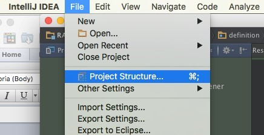
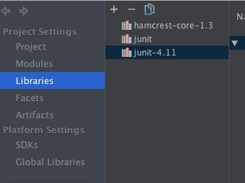
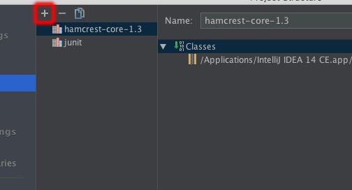
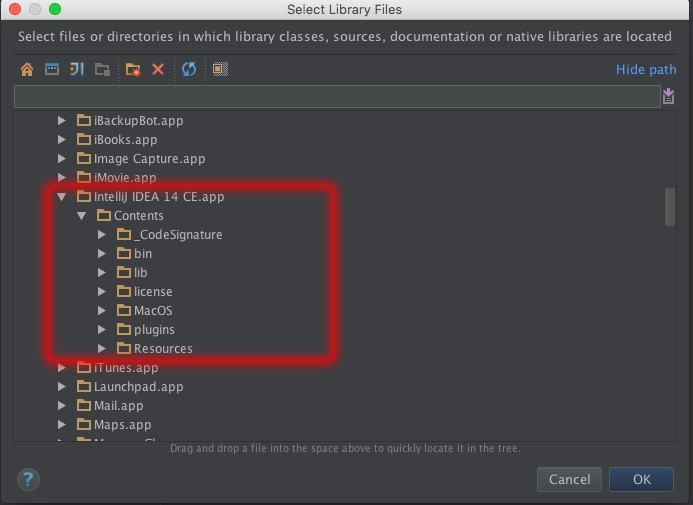
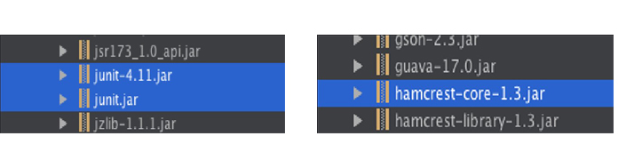
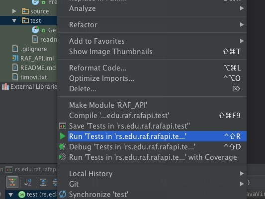

J_Unit tutorial
****************

Tutorial for configuring and running JUnit test in IntelliJ IDE

**Configuration:** 

1. Once you open IntelliJ, go to File-->Project Structure

2. When the window "Project Structure" opens, choose the option "Libraries" from the left sidebar

3. Click on + in the upper left corner

4. In the open window go to the location where IntelliJ is installed

5. Go to Contents --> lib and select next .jar files:

		``junit-4.11.jar (it might happen that you have another version)``
		
		``junit.rar``
		
		``hamcrest-core-1.3.jar``
		

		
6. Click "OK", you will get the "Choose modules" window in which you should click "OK". After that you will be brought back to "Project structure" window where you will first click "Apply" and then "OK."

**Pokretanje testa**

1. Right click folder "Tests" and choose "Run tests in 'rs.edu.raf.rafapi.test'

